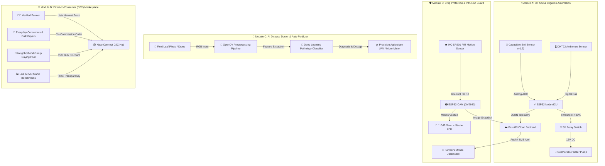

# 🌾 KisanConnect — Comprehensive Smart Agriculture & D2C Ecosystem

[](#)
[](#)
[](#)
[](#)
[](#)
[](#)

> **"From Seed in Dry Soil to Direct Consumer Sale"**  
> An end-to-end socio-technical agricultural ecosystem engineered to automate field irrigation via IoT, guard crops against wildlife and thieves, diagnose crop diseases early with AI-directed fertilization, and eliminate middleman exploitation through a direct-to-consumer (D2C) marketplace.

---

## 🏗️ 1. Complete System Architecture & 4 Core Pillars



---

## 🚀 2. Modular Directory Structure

```text
KisanConnect/
│
├── 📂 iot-firmware/                    # 💧 Hardware Layer: Microcontroller Code & Circuitry
│   ├── soil_irrigation_esp32.ino        # ESP32 Soil Moisture & Automated Relay Pump firmware
│   └── perimeter_guard_pir_cam.ino     # ESP32-CAM + PIR motion detection & deterrent strobe
│
├── 📂 ai-vision/                       # 🔬 AI Layer: Plant Pathology & Drone Dispensing
│   ├── leaf_disease_detector.py        # OpenCV + Deep Learning leaf diagnostic classifier
│   ├── drone_fertilizer_controller.py  # Precision UAV & variable-rate dosage controller
│   └── requirements.txt                # Python computer vision dependencies
│
├── 📂 backend/                         # ⚡ Cloud API Layer: FastAPI REST Services
│   ├── main.py                         # REST Endpoints (Telemetry, Security, AI, Marketplace)
│   ├── models.py                       # Pydantic data validation schemas
│   └── requirements.txt                # FastAPI, Uvicorn & SQLAlchemy dependencies
│
├── 📂 database/                        # 🗄️ Storage Layer: Relational Schemas & Logs
│   └── schema.sql                      # PostgreSQL / Supabase schema for all 4 modules
│
├── 📂 frontend-web/                    # 🌐 Client Layer: Nordic-Organic Bento Web Application
│   ├── index.html                      # Complete 4-Pillar Interactive Web Interface
│   ├── style.css                       # Responsive Nordic-Organic Bento Styling & Animations
│   └── app.js                          # IoT Simulator, AI Scanner, Multilingual & Voice Agent
│
└── README.md                           # Comprehensive Architectural Blueprint
```

---

## 🔌 3. Hardware Schematics & Pinout Configurations

### Module A: ESP32 Smart Irrigation Node
```text
 +---------------------------------------------------------+
 |                      ESP32 NodeMCU                      |
 |                                                         |
 |  [3V3] ----------> VCC (Capacitive Moisture Sensor v1.2)|
 |  [GND] ----------> GND (Capacitive Moisture Sensor v1.2)|
 |  [GPIO 34] <------ Analog AOUT (Moisture ADC Reading)   |
 |                                                         |
 |  [GPIO 26] ------> IN1 (5V Relay Module Active-Low)     |
 |  [VIN (5V)] -----> VCC (5V Relay Module)                |
 |  [GND] ----------> GND (5V Relay Module)                |
 |                                                         |
 |  Relay COM ------> 12V DC External Power Supply (+)     |
 |  Relay NO -------> Submersible Water Pump (+)           |
 +---------------------------------------------------------+
```

### Module B: ESP32-CAM Perimeter Guard Node
```text
 +---------------------------------------------------------+
 |                     AI-Thinker ESP32-CAM                |
 |                                                         |
 |  [5V] -----------> VCC (HC-SR501 PIR Sensor)            |
 |  [GND] ----------> GND (HC-SR501 PIR Sensor)            |
 |  [GPIO 13] <------ OUT (PIR Motion Trigger High)        |
 |                                                         |
 |  [GPIO 14] ------> Base (NPN Transistor -> 110dB Siren) |
 |  [GPIO 15] ------> Gate (MOSFET -> High-Power Strobe)   |
 |  [GPIO 4]  ------> Built-in High-Intensity Camera Flash |
 +---------------------------------------------------------+
```

---

## 📡 4. REST API Reference (FastAPI Backend)

| Method | Endpoint | Module | Description |
|---|---|---|---|
| `POST` | `/api/v1/telemetry/soil` | **Module A** | Ingests soil moisture %, ambient temperature, and humidity; executes pump relay commands. |
| `POST` | `/api/v1/security/intrusion` | **Module B** | Receives perimeter motion triggers & camera snapshots; fires siren alerts & SMS notifications. |
| `GET` | `/api/v1/security/alerts` | **Module B** | Retrieves recent farm intrusion and wildlife deterrent event logs. |
| `POST` | `/api/v1/ai/diagnose` | **Module C** | Ingests leaf photo, outputs diagnostic pathology classification, and calculates drone spray dosage. |
| `GET` | `/api/v1/marketplace/listings` | **Module D** | Fetches active direct farm produce listings with Mandi vs Retail price contrast. |
| `POST` | `/api/v1/marketplace/order` | **Module D** | Processes direct farm-gate purchase orders with 0% intermediary deductions. |

---

## ⚡ 5. Mathematical Models & Price Transparency Formulas

### 1. Soil Volumetric Water Content (VWC) Calibration Formula:
$$\text{Moisture (\%)} = \left( \frac{\text{ADC}_{\text{dry}} - \text{ADC}_{\text{raw}}}{\text{ADC}_{\text{dry}} - \text{ADC}_{\text{wet}}} \right) \times 100$$
* *Trigger Condition:* If $\text{Moisture} < 30.0\%$, Relay State $\rightarrow \text{ACTIVE}$ until $\text{Moisture} \ge 65.0\%$.

### 2. Direct Consumer Savings Math:
$$\text{Consumer Savings (\%)} = \left( \frac{\text{Supermarket Retail Price} - \text{Farmer Direct Price}}{\text{Supermarket Retail Price}} \right) \times 100$$

### 3. Farmer Extra Profit Math:
$$\text{Farmer Gain (\%)} = \left( \frac{\text{Farmer Direct Price} - \text{Mandi Intermediary Price}}{\text{Mandi Intermediary Price}} \right) \times 100$$

---

## 🏆 6. Hackathon & Devpost Submission Blueprint

### Inspiration
Agriculture is the lifeblood of society, yet Indian farmers face compounding, systemic challenges: erratic rain leading to bone-dry soil, night-time crop devastation by stray animals and thieves, silent plant fungal diseases that destroy yields, and financial exploitation by middlemen who pocket 40–60% of produce margins. We created **KisanConnect** as a true socio-technical ecosystem protecting crops from the root-zone up to digital consumer fulfillment.

### What It Does
KisanConnect operates across **4 unified pillars**:
1. **Soil & Dry Watering Automation:** ESP32 nodes dynamically monitor root hydration and trigger automated pumps only when crops need it.
2. **Crop Protection & Intrusion Guard:** Perimeter PIR sensors and cameras instantly catch intruders/wild animals and activate deterrent sirens and lights.
3. **AI Disease Detection & Auto-Fertilizing:** Computer vision models diagnose leaf pathologies and direct precision drone micro-spraying.
4. **Direct-to-Consumer (D2C) Marketplace:** Web platform where farmers sell directly to consumers at fair prices with live Mandi transparency.

### How We Built It
* **Hardware & IoT:** C++ / Arduino firmware on ESP32, Capacitive Soil Sensors, HC-SR501 PIR, Relays, and OV2640 camera modules.
* **AI & Machine Learning:** Python, OpenCV, and PyTorch for leaf image CLAHE preprocessing and disease inference.
* **Cloud & Database:** FastAPI REST framework paired with a PostgreSQL / Supabase relational schema.
* **Frontend Web App:** Modern HTML5, CSS3 Grid (Nordic-Organic Bento UI), Chart.js, 6-language switcher, and Web Speech API Voice AI.

---

## 🚀 7. How to Run Locally in 5 Seconds

### 1. Launch Interactive Web App in Chrome
Simply double-click `index.html` or run:
```bash
# Navigate to directory
cd KisanConnect

# Run local web server
python -m http.server 8080
```
Open **`http://localhost:8080`** in your browser.

### 2. Launch FastAPI Backend
```bash
cd backend
pip install -r requirements.txt
python main.py
```

### 3. Run AI Disease Doctor Script
```bash
cd ai-vision
pip install -r requirements.txt
python leaf_disease_detector.py
```

---

<div align="center">
  <sub>Built with ❤️ for Indian Agricultural Prosperity • 100% Client-Side Ready • MIT License</sub>
</div>
