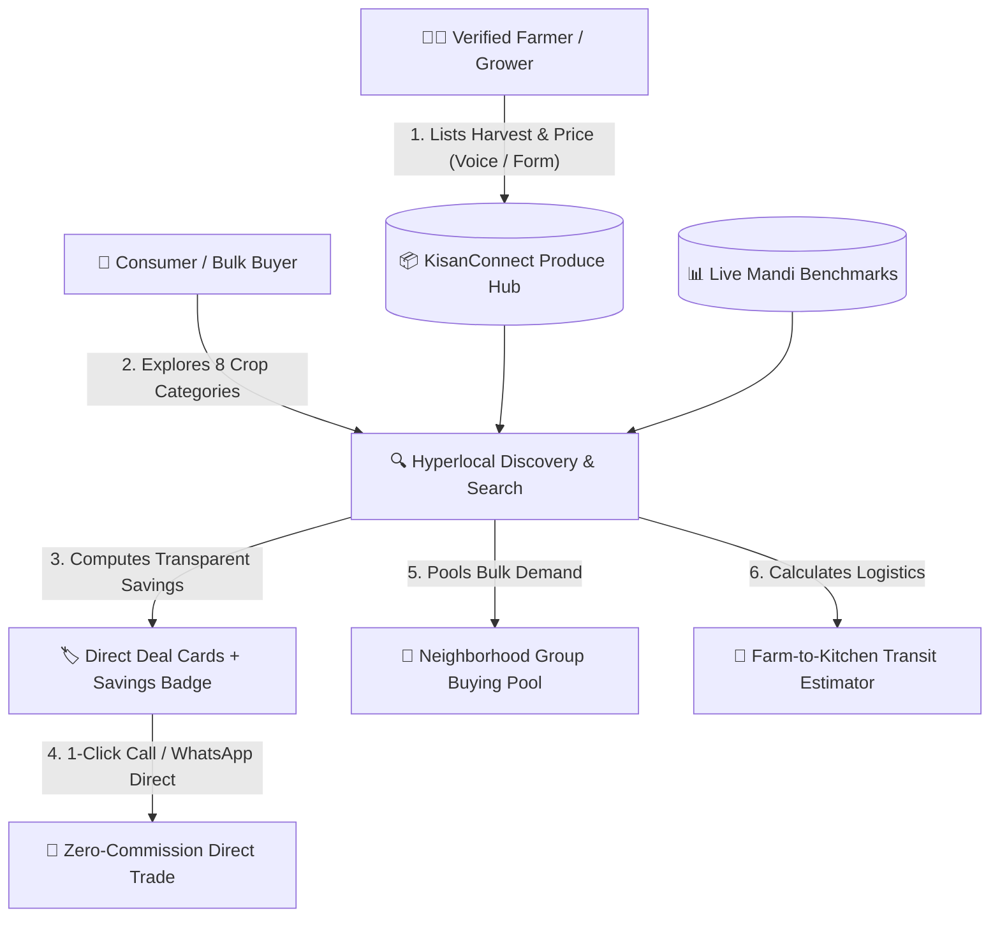

# 🌾 KisanConnect — Direct Farm-to-Consumer Agri-Marketplace

[](#)
[](#)
[](#)
[](#)
[](#)

> **"Fair Prices for Growers • Fresh Produce for Families"**  
> An open, zero-commission agricultural network directly connecting Indian farmers to consumers, restaurants, and bulk buyers with live APMC Mandi price benchmarks, regional language support, and a voice assistant.

---

## 📌 1. Project Overview & Problem Solved

* **The Problem:** In India's traditional agricultural supply chain, 3 to 4 layers of intermediaries (village brokers, commission agents, wholesalers, retailers) siphon away **40% to 60% of the produce value**. Farmers often receive meager farm-gate prices while consumers pay inflated retail rates.
* **Our Solution:** **KisanConnect** bypasses intermediary markups entirely by providing:
  1. **Direct Farm-Gate Marketplace:** Verified farmers list harvest batches with transparent pricing.
  2. **Live Mandi vs. Retail Price Comparisons:** Real-time visual comparison showing direct farmer rates, mandi wholesale rates, and retail supermarket benchmarks.
  3. **Multilingual Regional Support:** 6 Indian languages (English, Hindi, Punjabi, Telugu, Kannada, Marathi).
  4. **Kisan Mitra AI Voice Agent:** Voice-enabled assistant for rural farmers to ask prices, list crops, or connect with toll-free support.
  5. **Neighborhood Group Buying Pools:** Societies and colonies pool bulk demand to unlock 15% discounts and free farm freight.

---

## 🏗️ 2. System Architecture



---

## 🌟 3. Key Features

| Feature | Description |
| :--- | :--- |
| **🌐 Multilingual Language Switcher** | Switch instantly between **English, हिन्दी (Hindi), ਪੰਜਾਬੀ (Punjabi), తెలుగు (Telugu), ಕನ್ನಡ (Kannada), and मराठी (Marathi)**. |
| **🎙️ Kisan Mitra AI Voice Assistant** | Interactive voice agent with speech recognition and speech synthesis (TTS) to assist farmers with mandi prices, crop listing, and agricultural helplines. |
| **🌾 8 Distinct Produce Categories** | 1. Grains & Millets • 2. Fresh Vegetables • 3. Organic Pulses • 4. Direct Spices • 5. Orchard Fruits • 6. Cold-Pressed Oils • 7. Raw Forest Honey & Dairy • 8. Ayurvedic Herbs. |
| **🤝 Neighborhood Group Buying Pools** | Community order-pooling widget where societies pledge bulk weight to unlock lower farm-gate pricing and free collective freight. |
| **🚚 Farm-to-Doorstep Transit Estimator** | Select origin (*Mandya, Nashik, Ludhiana, Guntur, Agra*) and destination (*Bengaluru, Mumbai, Delhi, Hyderabad, Chennai*) to calculate direct highway distance and transit hours. |
| **📅 Seasonal Crop Harvest Calendar** | Highlights peak harvests happening **Now (September Kharif)** vs **Upcoming (October/November Rabi)**. |
| **⚡ Live Middleman-Bypass Price Calculator** | Dynamic comparison slider calculating farmer extra profit % and consumer savings %. |
| **📊 Impact & Analytics Dashboard** | Chart.js visual analytics tracking traded quintals and financial gains over intermediary routes. |

---

## 📐 4. Economic & Price Transparency Formulas

$$\text{Consumer Direct Savings (\%)} = \left( \frac{\text{Retail Market Price} - \text{Farmer Direct Price}}{\text{Retail Market Price}} \right) \times 100$$

$$\text{Farmer Extra Margin (\%)} = \left( \frac{\text{Farmer Direct Price} - \text{Mandi Intermediary Price}}{\text{Mandi Intermediary Price}} \right) \times 100$$

### Live Calculation Example:
* **Fresh Red Tomatoes (1,000 kg Batch):**
  * Traditional Mandi Broker Buy Rate: **₹14/kg**
  * Supermarket Retail Rate: **₹38/kg**
  * **KisanConnect Direct Farm Rate:** **₹22/kg**
  * **Farmer Earnings:** +57.1% higher profit
  * **Consumer Savings:** 42.1% lower cost

---

## 🚀 5. How to Run Locally in 3 Seconds

### Option A: Direct Open in Chrome
1. Double-click **`index.html`** or right-click ➔ **Open with Google Chrome**.
2. The entire application runs immediately with zero installation required!

### Option B: Local Web Server
```bash
# Navigate to project folder
cd KisanConnect

# Run lightweight Python server
python -m http.server 8080
```
Open **`http://localhost:8080`** in your browser.

---

## 📂 6. Repository File Structure

```text
KisanConnect/
│
├── index.html                  # Main Web Page & Bento Layout
├── style.css                   # Nordic-Organic Stylesheet & Animations
├── app.js                      # Price Engine, Multilingual & Voice AI Logic
├── README.md                   # Interactive Documentation & Architecture Guide
└── KisanConnect_3Files_Codebook.pdf  # Printable Codebook & Guide PDF
```

---

## 📞 7. National Farmer Support Integration

* **National Kisan Call Center:** `1800-180-1551` (Toll-Free, 6 AM to 10 PM in 22 regional languages)
* **Direct WhatsApp Order Channel:** 1-Click direct chat connecting buyers to growers.

---

<div align="center">
  <sub>Built with ❤️ for Indian Agricultural Prosperity • 100% Client-Side • MIT License</sub>
</div>
