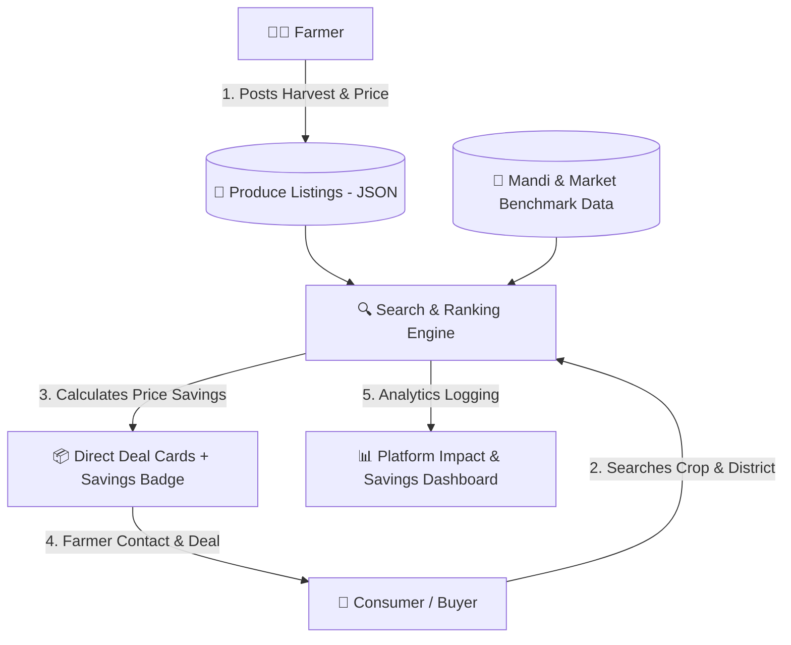

# 🌾 KisanConnect — Farmer-to-Consumer Direct Marketplace

[](https://sih.gov.in)
[](#)
[](#)
[](#)

> **"Fair Prices for Farmers, Fresh Produce for You"**  
> A transparent agricultural marketplace eliminating middleman markups by connecting farmers directly to consumers and bulk buyers with live price comparisons.

---

## 📌 Executive Summary

* **Problem Statement:** Indian farmers receive as little as 20–30% of the retail price paid by consumers due to 3–4 layers of middlemen, while consumers pay inflated prices.
* **Our Solution:** KisanConnect provides a direct trading portal featuring **transparent live price comparisons** showing the direct farmer price vs the traditional mandi/middleman markup.

---

## 🏗️ System Architecture



---

## ⚡ Price Transparency & Savings Math

For each crop listing, KisanConnect executes a transparent financial comparison:

$$\text{Consumer Savings (\%)} = \left( \frac{\text{Market Price} - \text{Farmer Direct Price}}{\text{Market Price}} \right) \times 100$$

$$\text{Farmer Extra Margin (\%)} = \left( \frac{\text{Farmer Direct Price} - \text{Mandi Intermediary Price}}{\text{Mandi Intermediary Price}} \right) \times 100$$

### Example Live Calculation:
* **Tomatoes:**
  * Mandi Middleman Buy Price: ₹18/kg
  * **KisanConnect Farmer Price:** **₹28/kg** (Farmer earns **+55% more**)
  * Retail Market Price: ₹40/kg
  * **Consumer Direct Price:** **₹28/kg** (Consumer saves **30%**)
  * **Result: WIN-WIN for both producer and consumer!**

---

## 🌟 Core Features

- [x] **Farmer Self-Listing Portal:** Easy-to-use form with crop name, quantity (kg/quintal), price, harvest date, and location.
- [x] **Buyer Discovery Engine:** Filter by crop, district, and price range with distance simulation.
- [x] **Live Middleman Markup Comparison:** Prominent visual badges comparing direct savings against typical retail prices.
- [x] **Farmer Revenue Dashboard:** Visual comparison of direct income vs traditional mandi income.
- [x] **Platform Impact Overview:** Total middleman markup eliminated and volume of produce traded.
- [x] **Pre-populated Agricultural Dataset:** 15+ realistic listings across staples (wheat, rice, pulses) and perishables (tomatoes, onions, mangoes).

---

## 🛠️ Tech Stack & Justification

| Layer | Technology | Why Chosen? |
| :--- | :--- | :--- |
| **Frontend** | HTML5, CSS3, JavaScript (ES6) | Responsive, mobile-friendly design accessible on low-end devices. |
| **Theme & UI** | Earthy Green & Harvest Gold | Trustworthy, accessible agri-tech visual aesthetic. |
| **Data Storage** | `listings.json` + `market_prices.json` | Fast, lightweight benchmark data without external DB lag. |
| **Visualizations** | Chart.js | Visual comparison of farmer profit margins vs middleman cuts. |

---

## 🚀 Quick Start Guide

```bash
# 1. Clone the repository
git clone https://github.com/Shaikshadik03/KisanConnect.git

# 2. Open the project folder
cd KisanConnect

# 3. Launch the app
python -m http.server 5000
```
Open `http://localhost:5000` in your web browser.

---

## 🎤 2-Minute Presentation Pitch for Judges

<details>
<summary><b>Click to expand speaking points for presentation</b></summary>

1. **Hook:** "Why does a consumer in Bangalore pay ₹40/kg for onions while the farmer in Nashik barely receives ₹15/kg?"
2. **Problem:** "Multiple layers of middlemen take up to 60% of agricultural value without adding quality."
3. **Solution:** "KisanConnect removes unnecessary middlemen and connects farmers directly to consumers and bulk buyers."
4. **Demo Moment:** "Look at our live price comparison: for 100kg of organic wheat, the buyer saves ₹800 and the farmer earns ₹1,200 more than selling to a village trader."
5. **Future Roadmap:** "Integration with government e-NAM APIs, farm-gate logistics aggregation, and regional vernacular voice interfaces."
</details>
